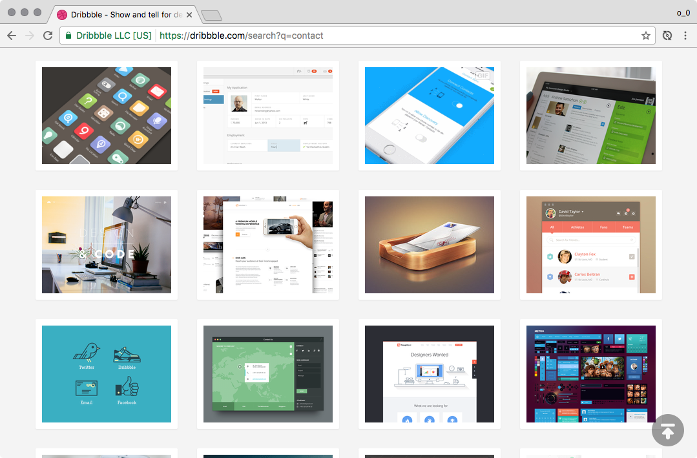
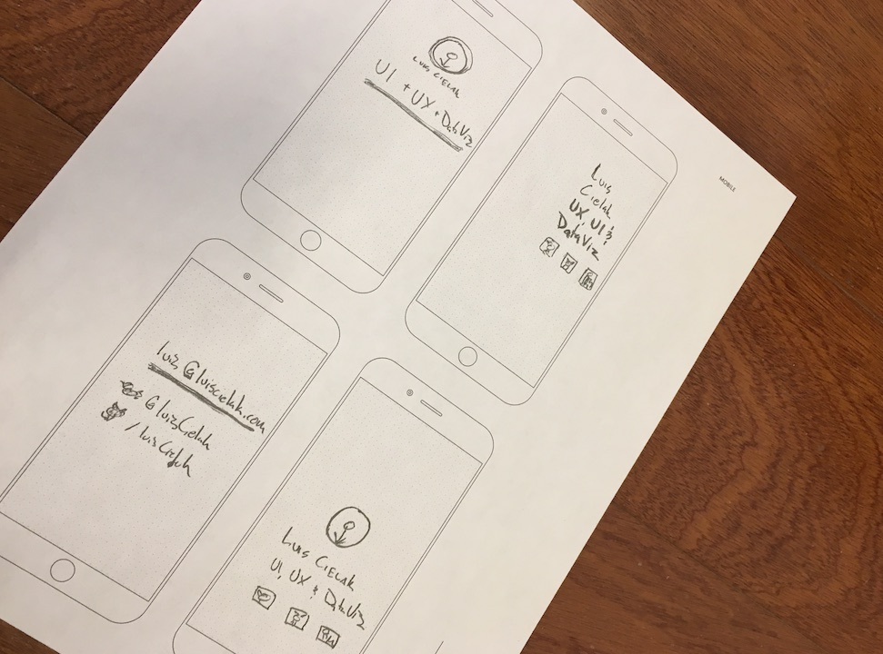
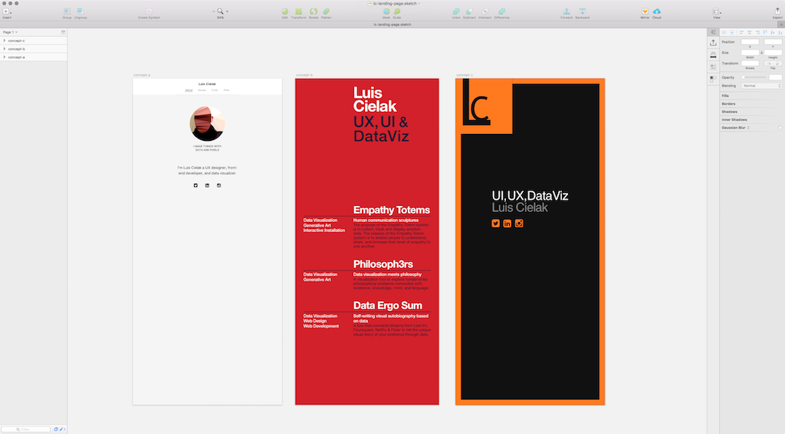
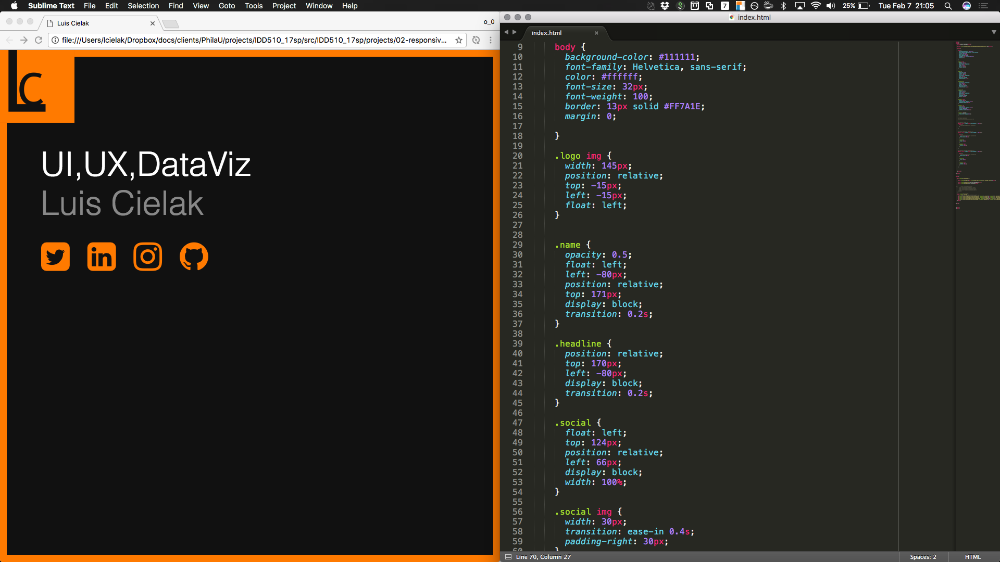
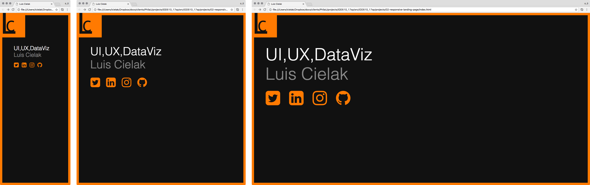

# Project 02 - Responsive Landing Page

This project consists of designing and implementing a responsive landing page. You will sketch a few ideas of a personal landing page. The page should at least include your name, title, and contact information. You will design three different layouts for three different screen sizes (mobile, tablet, desktop)


## Project: Your Branded Landing Page

1. Search the web for inspiration on contact pages, landing pages
2. Sketch a few concept ideas using [Printable Wireframing Grids](http://sneakpeekit.com/) 
3. Finalize one concept for three different screens: mobile, tablet, desktop
4. Vectorize your concepts using Sketch, Illustrator or Photoshop
5. Code your landing page using HTML and CSS
6. Test your implementation to make sure everything works on multiple screens


- - -


### 1. Search the web for inspiration on contact pages, landing pages



### 2. Sketch a few concept ideas using printable wireframing grids



* [Mobile Grid x4](printable-grids/sneakpeekit-4-mobiles-grid.pdf)

* [Tablet Grid](printable-grids/sneakpeekit-tablet-grid.pdf); [Tablet Grid x4](printable-grids/sneakpeekit-4-tablets-grid.pdf)

* [Desktop Grid](printable-grids/sneakpeekit-browser-grid.pdf); [Desktop Grid x4](printable-grids/sneakpeekit-4-browsers-grid.pdf)


### 3. Finalize one concept for three different screens: mobile, tablet, desktop

* Mobile: `320x768`
* Tablet: `768x768`
* Desktop: `1024x768` 


### 4. Vectorize your concepts using Sketch, Illustrator or Photoshop




### 5. Code your landing page using HTML and CSS

Media Queries for Common Device Breakpoints:

```
/* Mobile Phone */ 
@media only screen and (min-width : 320px) {
  /* Styles */ 
}


/* Small Devices, Tablets */
@media only screen and (min-width : 768px) {
  /* Styles */ 
}

/* Medium Devices, Desktops */
@media only screen and (min-width : 992px) {
  /* Styles */ 
}

/* Large Devices, Wide Screens */
@media only screen and (min-width : 1200px) {
  /* Styles */ 
}



```

### 6. Test your implementation to make sure everything works on multiple screens




