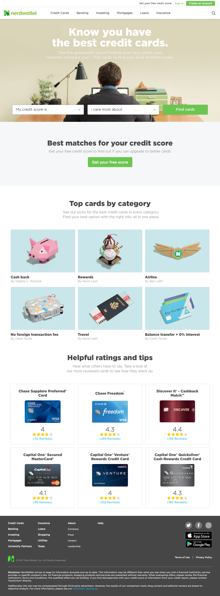

# Project 3 - UX Deconstruction

In this project you will select a website or app of your choice and generate the proper UX deliverables. The deliverables that you will be focusing on are **user personas**, **user flows**, **moodboard**, and a **styleguide**. Once your artifacts are created you will upload the assets to InVision.

## Project: Deconstructing [Nerdwallet][1]

1. Deconstruct style-guide
  - Take a screenshot of the current page
  - Extract the main brand colors and typography
  - Select the main UI components (buttons, fields, icons, etc)
  - Document your findings in a moodboard

2. Define three (3) user personas
  - Derive from the content who is the target audience
  - Define the demographics and characteristics of the potential users
  - Document your findings in a user profile

3. Identify two (2) user journeys
  - Define a few main objectives for the potential user
  - Identify key interaction points required to accomplish each task
  - Document your findings by developing a user-flow diagram

- - -

### 1. Deconstruct style-guide

**Nerdwallet - Home**

### 2. Define three (3) user personas

### 3. Identify two (2) user journeys

[1]: https://www.nerdwallet.com/
