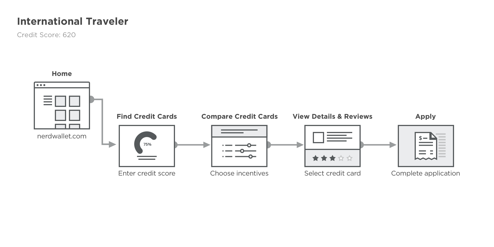

# Project 3 - UX Deconstruction

In this project you will select a website or app of your choice and generate the proper UX deliverables. The deliverables that you will be focusing on are **user personas**, **user flows**, **moodboard**, and a **styleguide**. Once your artifacts are created you will upload the assets to InVision.

## Project: Deconstructing [Nerdwallet][1]

1. Deconstruct style-guide
  - Take a screenshot of the current page
  - Extract the main brand colors and typography
  - Select the main UI components (buttons, fields, icons, etc)
  - Document your findings in a styleguide and upload to InVision

2. Define three (3) user personas
  - Derive from the content who is the target audience
  - Define the demographics and characteristics of the potential users
  - Document your findings in a user profile

3. Identify two (2) user journeys
  - Define a few main objectives for the potential user
  - Identify key interaction points required to accomplish each task
  - Document your findings by developing a user-flow diagram

**Resources:**

* [WhatFont Extension][2]
* [Full Page Screen Capture Extension][3]

- - -

### 1. Deconstruct style-guide

**Nerdwallet - Home**

**Styleguide:**

### 2. Define three (2) user personas 

For people looking to apply for a credit card.

- Frequent international business traveler representative.
- Online shopper that wants to earn rewards.
- Business owner that buys company equipment and pays for services.

### 3. Identify two (2) user journeys

> “As a `<type of user>`, I want `<some goal>` so that `<some reason>`.”

- As a *college student*, I want to have an *emergency fund*, so that *I can get gas and food when in distress*.

(No annual fee, average credit score, low interest, cash-back)

- As an *international traveler*, I want be able to *make purchases abroad* so that I can *earn points and get free flights*.

(No foreign transaction fees, works globally, regards incentives)

- As a *high-school student*, I want to *find out my credit score*, so that *I can apply for a credit card*.

[1]: https://www.nerdwallet.com/
[2]: https://chrome.google.com/webstore/detail/whatfont/jabopobgcpjmedljpbcaablpmlmfcogm
[3]: https://chrome.google.com/webstore/detail/full-page-screen-capture/fdpohaocaechififmbbbbbknoalclacl